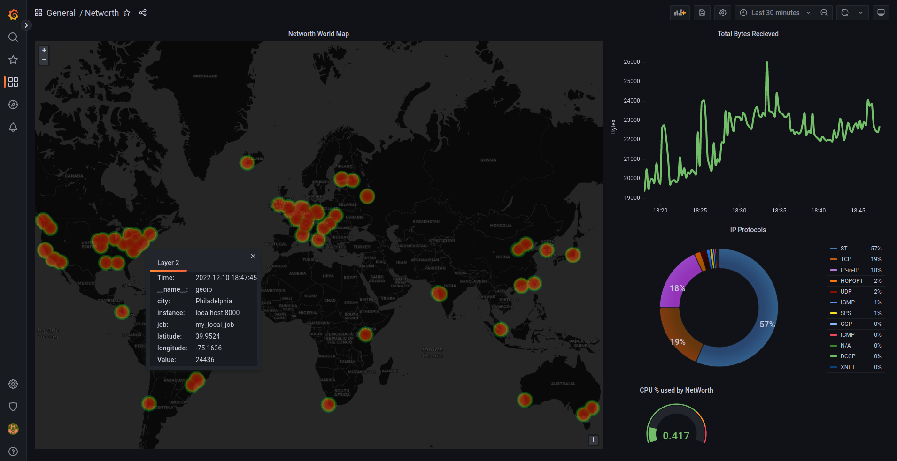

# NetWorth

<p align="center">
Monitor your host's ingress data packets leveraging the power of eBPF and XDP. Visualise it in Grafana through Prometheus.
</p>
 

### Features
- Observe the locations of the Servers you are querying your packets from through the World Map
- Get the number of bytes you are receving on your Network Interface Card
- Get the number and types of Layer 4 protocols your host is dealing wtih
- Set an alert on the % of the CPU used by NetWorth


### Requirements
- Python3
- pip
- Grafana
- Prometheus

### Steps to run locally:
1. Clone and get into the repository

```
git clone https://github.com/ShubhamPalriwala/NetWorth
cd Networth/
```

2. Install the required Python dependencies:

```
pip install -r requirements.txt
```

3. Install dev tools and Linux Kernel Headers through your package manager (example apt):

```
sudo apt install bcc-tools linux-headers-$(uname -r)
```

4. Start the Grafana service: 
```
sudo systemctl start grafana.service
```

5. Start the prometheus server:
```
prometheus --config.file=prometheus.yml
```

6. Finally start the eBPF program:
```
sudo python3 caller.py
```

7. Now head over to Grafana and import the Dashboard by uploading the `grafana.json` file.

*Congrats! You should now be able to see your NetWorth!*


## Artifacts available:
1. Prometheus Logs at localhost:8000
2. Grafana Dashboard at localhost:3000


#### Note
If you plan to use this for more than just fun, I would recommend you get an API key from https://ipinfo.io/ for unobstructed monitoring and add it to the `sample.env` and then rename it to `.env`


## License

Copyright 2022 Shubham Palriwala

Licensed under [MIT License](./LICENSE)

<p align="center">Made to learn and explore :honeybee: eBPF</p>